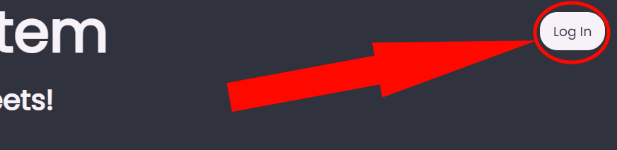
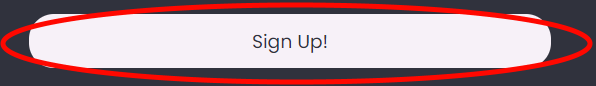
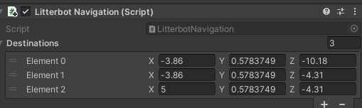
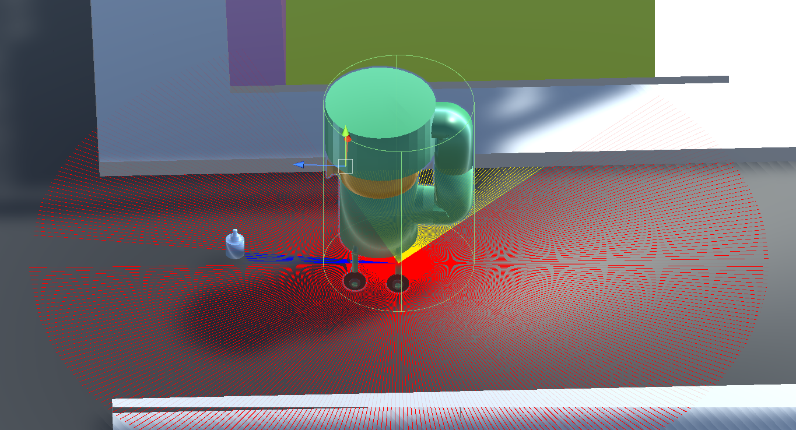

# Litterbot
## A brief description
This is a robot that helps clean up the streets, coupled with a website for reporting rubbish. This project was created for the CodeSec National Finals 2022, around the topic of the Environmental Sector.

## Table of Contents:
1) [The admin application](#the-admin-application)
2) [The website](#the-website-and-how-to-use-it)
3) [The backend server](#the-backend-server)
4) [The Litterbot](#the-litterbot)
5) [Links to the main code files (for judging)](#links-to-the-main-code-files-for-judging)
6) [How to install and use/test our product](#how-to-install-and-usetest-our-product)
7) [Further steps we would take to make this a reality](#further-steps-we-would-take-to-make-this-a-reality)
8) [Comments that could not be written (what was done inside the Unity editor)](#comments-that-could-not-be-written-what-was-done-inside-the-unity-editor)

## The admin application
For anshul to fill out

## The website and how to use it
This website can be visited at [www.thequintuscult.co.uk/litterbot](https://www.thequintuscult.co.uk/litterbot)

When we designed our website, we had one goal: clean, simple UI that was nice to look at. We settled on a dark theme by default to be relaxing to the eyes, but with colours that were not too dark to avoid a clichéd appearance. For those that like brighter colours, we added an option to toggle to day mode:

If you are not logged in, you can click on the login button:

Which will take you to the login screen:

As you can see with the password, autofill remembers your username and password (although the username was taken out for this demonstration), and your password is hidden for security. If you already have an account, you can simply click "Log In" after filling in your details, and you are in!

However, if you do not have an account, you can click on the signup button:

Which will take you to the signup screen:

Here you can fill in your signup details, and submit the form via the "Sign Up!" button:

This will take you to a verification screen to verify that it is actually you trying to signup:

An email looking like this:

Will be sent to an you and you can enter the 6 digit code:

To verify your account and complete the signup process. The email has been styled using HTML and CSS in a similar way to the website. If you have not received the email, you can click the resend email button:

You can then go back and log in!

After logging in, there are two things that you can do:
- Click your profile button on the home page (where the login button used to be):

 

 To view your profile, with information such as the number of reports that you have submitted:

 

 You can click the eye button:

 

 To reveal your password, and also delete your account using the delete acount button:

 

 You will need to enter your password in the popup that appears:

 

 To successfully delete your account.

- The second thing that you can do is submit a report of litter in your area, but you will need to make sure that geolocation services are enabled on you web browser. If you are not sure how to do this, you can use [this](https://whatismyipaddress.com/enabling-and-disabling-geolocation-on-your-browser) tutorial to find out how.

 All you need to do is click the submit report button:

 

 And you will automatically send a report our servers with your location. Do note however, that there is a 5 minute cooldown on this report:

 

## The backend server
### What it does
The backend server controls what goes on behind the scenes. It accepts requests from the website to get, alter, or delete information from the database via a web API built using the [Flask](https://flask.palletsprojects.com/en/2.1.x/) framework for Python. It also coordinates Litterbots sent out to areas with lots of litter and can interact with the rest of the robots as well. Finally, it also communicates with the admin application.

### How to run the server
All you need to do to use it is to create a file called "emailpassword.env" in the same directory as the application's (or the Python files). Then you need to create an app password using Google:
[myaccount.google.com](https://myaccount.google.com/) -> Security -> Signing in to google -> App Passwords.
Click "Select app", click "Other (custom name)", enter whatever name you want, and then click "GENERATE").
Set the first line of the "emailpassword.env" as the email of the account you used, and the second line as the password you just generated.

Then, save the file and run the app (or the Python files).

## The Litterbot
Litterbot was designed with a friendly, appearance, resembling famous robots such as Bugdroid (Android's logo/mascot).

### The physical design
Its body is elevated above the ground, in order to allow waste of all sizes to fit through its large vacuum, which would be metal to withstand waste that may be made of substances like glass. Waste is piped through a big pipe to the storage container on top, which also helps to maintain a small area to fit in tight spaces.

### Navigation
Litterbots are made to find the shortest route between all the destinations they are made to reach and the litter they detect through LIDAR technology (or at least an approximation in the simulation) and avoid obstacles, moving or not, along the way. Litterbots also interact with each other, and will stop pursuing litter when another robot picks it up, as well as forming a queue when trying to fit through tight spaces. These Litterbots can distinguish between objects that they can pick up and objects that they cannot and additional complications could easily be added in order to allow for a simulation more alike real life.

### Interaction with the administrator
The robots are given pre-programmed routes (which would be set in real life for real robots manually). The robots go back and forth along their route, picking up any litter they find on the road or on pavement edges. There is also a second group of robots, told to go to a site where many reports have been submitted from the website, and clear up any litter there. More robots can be told to go, or can be called back, at the operator's will. The Litterbots also send their live feed to the server for viewing on the admin application.

### How to view the simulation
To simulate their action, all you need to do is to press play (if simulating from the Unity editor) or run the application (if you choose to use the application). If you choose to use the Unity editor, you can also press the "Scene" button above the simulation, and move around the town. In this mode, you can more clearly focus on any Litterbot you want and also view the rays shot out by the Litterbots. Red rays represent where the Litterbot has searched and not found anything, yellow rays represent where the Litterbot has identified an object which it cannot pick up (such as a car tire, a bicycle or another Litterbot), and blue rays represent where the Litterbot has identified an object which it can pick up (litter, which has been shown here as either a bottle or a crisp packet). In game mode, Litterbots can be sent or recalled, and litter can be spawned at a random place on the road, all using the buttons provided.

## Links to the main code files (for judging)
### Website files
- [The index.html](https://github.com/MrFirekiller/litterbot/blob/master/website/public/index.html)
- [All of the files used by React for various purposes, such as styling, components, and debugging.](https://github.com/MrFirekiller/litterbot/tree/master/website/src)

### Server files
- [All of the python files and the database (which you technically cannot open but you can kind of see what is inside via a text editor.](https://github.com/MrFirekiller/litterbot/tree/master/server)

### Admin application files
- [All of the files required to create the admin application via the Electron framework. index.less is compiled so index.css, so please ignore the index.css.](https://github.com/MrFirekiller/litterbot/tree/master/adminapp/src)

### Litterbot scripts and other files
- [All of the .cs files. Please ignore the .meta files and the contents of the TextMesh Pro folder (auto generated).](https://github.com/MrFirekiller/litterbot/tree/master/litterbot/Litterbot/Assets/Scripts)
- [All of the blender files used to create the various models used. The town you can see was taken from the Unity asset store, and so cannot be seen. The bike models were taken from ](https://github.com/MrFirekiller/litterbot/tree/master/litterbot/Litterbot/Assets/Litterbot%20Models) [this website.](https://www.turbosquid.com/3d-models/3d-bike-bmx-bicycle-model-1486504) [Please ignore the .meta files as they were auto generated by Unity like before.](https://github.com/MrFirekiller/litterbot/tree/master/litterbot/Litterbot/Assets/Litterbot%20Models)

## How to install and use/test our product

## Further steps we would take to make this a reality
In order to have this product widespread, we may firstly need to host everything on the cloud, for a) better security and b) more uptime. We may have to implement a microservice based architechture, to enable support for more users at once and better resource efficieny. We would also have to actually make the robot, and recode it (while keeping the main concepts) to allow for interaction with hardware and generally work in the real world. We would do this using a framework called [ROS](https://www.ros.org/) which we initially looked at for making the robot simulation, but then chose Unity for the greater availability of support. In development, we would also use [CoppeliaSim](https://www.coppeliarobotics.com/) to simulate the robot (a tool that we also looked at using before deciding not to use ROS).

## Comments that could not be written (what was done inside the Unity editor)
For simulating the robot, we used Unity editor. However, some work in Unity was not coding, but still notable as it was necessary for the project to work. Here is a list of all the things that were done in Unity:

- Importing and adjusting the town asset:

 

- Giving the litter and Litterbot colliders (Unity's hitboxes), as well as positioning them:

 

- Assigning scripts to various components and assigning predetermined values to them in certain cases:

 

- Creating and adjusting a NavMesh and NavMeshAgents. The NavMesh controls which regions moving objects (the NavMeshAgents) can go on, and the NavMeshAgent component is used to control the object's movement and help it reach its destination. The bicycles and Litterbots have NavMeshAgents. This is what a NavMesh looks like (the blue plane):

 

- Making buttons:

 

- Testing the scripts hundreds of times via simulation:

 